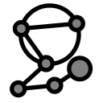

# TkzGeom

TkzGeom is a perfect GUI tool for the creation of publication quality figures
including but not limited to the following domains:

1. commutative diagrams
2. graphs and networks
3. Euclidean geometry in 2d
4. circuit diagrams (non natively)
5. other simple diagrams/figures

# Contents
<!-- TOC depthFrom:1 depthTo:6 withLinks:1 updateOnSave:1 orderedList:0 -->

- [TkzGeom](#tkzgeom)
- [Contents](#contents)
- [Demos](#demos)
	- [Example of editing a project](#example-of-editing-a-project)
- [Requirements](#requirements)
- [Usage](#usage)
	- [Move points on the canvas](#move-points-on-the-canvas)
	- [Move the canvas](#move-the-canvas)
- [Features](#features)
- [Shortcuts](#shortcuts)
- [Limitations](#limitations)
- [Binaries](#binaries)

<!-- /TOC -->

# Demos

## Example of editing a project

> Note that this animation is reduced in size and frame rate.

# Requirements

- **TeXLive 2019 or newer** or MiKTeX 2019 or newer
  (have not tested MiKTeX but should work in principle), more information
  TeXLive installation here: <a href="https://www.tug.org/texlive/acquire-netinstall.html">
  download texlive</a> (also make sure that the system environment variables
  are set up)

- A **pdf to png converter**, the default converter is `pdftocairo`,
  which is part of TeXLive. This can be configured in the settings menu.

- Libraries for Python can be installed using `pip install -r requirements.txt`.
  Note that here `Pygments` is not needed, only if the user wants to try other
  syntax highlighting than the built in.

# Usage

1. Run the software (run the makefile or the executable)
2. At the top of the window, select a tool.
3. Click on the canvas or select existing objects on the canvas.
4. Modify the appearance of object in the right-hand side of the window.
5. Copy the tikz code and paste it into your document.
6. Save the project so that it can be opened and modified later.

## Move points on the canvas

Hover the mouse pointer over a free point. Press and hold **Alt** on Windows,
**AltGr** on Linux. Move the mouse the its new location while keeping the key pressed.
Release the key.

## Move the canvas

Move the mouse pointer to the canvas. Press and hold **Ctrl**. Move the mouse to
a new place. Release the key.

# Features

1. instantly generated TikZ code,
2. move points on the canvas,
3. auto compilation into PDF for visual feedback,
4. additional packages and libraries can be added,
5. additional tikz code can be added after the generated code, so unimplemented
   features can be used on the user defined points, e.g. this can be used to
   define electric circuits with ease,
6. additional code can be added before the image, this is useful
e.g. for `\newcommand`s,
8. projects can be saved, and loaded in the popular JSON extension.

> Basic knowledge of tikz helps make the most out of this software.

# Shortcuts

|Key             |Shortcut of                         |
|----------------|------------------------------------|
|CTRL+Z          |undo                                |
|CTRL+SHIFT+Z    |redo                                |
|Delete          |delete object in the properties menu|
|F5              |compile the current version of edit |
|CTRL+O          |open existing project               |
|CTRL+S          |save current project                |
|CTRL+SHIFT+S    |save as                             |
|CTRL+N          |create new project                  |

<!--
/# Object explanation
/## Point
**point**: click <ins>anywhere</ins> on the canvas;
defines a point at any coordinate,

**point on line**: click <ins>segment</ins> or <ins>two points</ins> then enter ratio in a popup window;
defines a point on a segment dividing it with a given ratio (can be any real number)

**point on circle**: click <ins>circle, then enter angle</ins> (in degrees) in a popup window;
defines a point on a circle at specified angle to the abscissa

**intersection**: click <ins>four points</ins> (endpoints of segment 1 then endpoints of segment 2), or click <ins>two segments</ins>, or click <ins>a circle and a segment</ins>, or click <ins>a segment and a circle</ins>, or <ins>two points and a circle</ins>;
defines the intersection of two lines, or a line and a circle, (in the latter case, two intersection points are possible), (circle-circle intersection is not yet implemented)

**midpoint of segment**: click <ins>two points</ins> or a <ins>segment</ins>;
defines the middle points of a segment

**midpoint of circle**: click <ins>circle</ins>;
defines the middle of a circle

**orthogonal projection**: click <ins>three points</ins>, or <ins>a segment and a point</ins>, or <ins>a point and a segment</ins> (the first two points define the segment, the last point to point to be projected);
defines the orthogonal projection of a point onto a line

**bisector**: click <ins>three points</ins> (at the second point is the angle, the direction of angle matters);
defines a point on the bisector of an angle

**translate with vector**: click <ins>three points</ins>:
defines a new point from old after translation by vector

**perpendicular**: click <ins>two points</ins>;
defines a point on the perpendicular to the segment at the first point

**rotation**: click <ins>two points and angle in degrees</ins> in a popup window;
defines a point on rotated by a given angle around another point

**make grid**: click <ins>three points and rows and columns</ins> in a popup window (these points will span the grid);
defines the lattice of points generated by the three selected points (movement of the three points results in the entire lattice move)

/## Segment

**segment**: click <ins>two points</ins>;
defines a segment connecting the two points

**polygon**: click <ins>the vertices of the polygon and click the first vertex again</ins> to conclude selection;
defines a polygon object

**linestring**: click <ins>the vertices of the linestring and the last vertex again</ins> to conclude;
defines a linestring object

/## Circle

**circumscribed circle**: click <ins>three points</ins>;
defines the circumscribed circle around three points

**circle by its radius**: click <ins>two points</ins>;
defines a circle with first point as centre, the second point as a point on the perimeter

**arc**: click <ins>three points</ins>;
defines an arc with first point as center, the other two defining the radius and range

**sector**: click <ins>three points</ins>;
defines a sector with first point as center, the other two defining the radius and range

**inscribed circle**: click <ins>three points</ins>;
defines the inscribed circle around three points
/## Interactions
**move point**: drag free points the change their positions

**move canvas**: drag canvas to a new position
/## Decorators
**mark angle**: click <ins>three points</ins>;
defines an arc to show the presence of an angle

**mark right angle**: click <ins>three points</ins>;
defines an arc to show the presence of a right angle
-->

# Limitations

Select features are included as part of the GUI, enough to cover most everyday
situations, but does not aim to be comprehensive. To mitigate this issue,
there is an option to add any code after the automatically generated code,
and also to add other LaTeX packages/libraries. The draw order of objects is
predetermined, there is no built in way to change this.
(e.g. segments are always drawn above polygons.)

# Binaries

- old version for Windows 10:\
<a href="https://mega.nz/file/58cHAQJJ#ViVTsIa1EE4nqlMXZhILufJB4re2-jTaOdPdLnbHbJU">tkzgeom_old_version.zip</a>

- new version for Window 10:\
<a href="https://mega.nz/file/Q1VlzDIS#_snfzzVSq1SYR1niMtmYTxf75FjQu9mkCoD36ECoqpA">tkzgeom_2022_06_18_snapshot.zip</a>
\
<a href="https://mega.nz/file/d9Ul0bqY#zx42pDJsE8gSEDkS-bgq-U3gxz53ZMJNxBXv9cxGBw4">tkzgeom_2022_06_08_snapshot.zip</a>
\
<a href="https://mega.nz/file/ppVWWCzA#qMstD6LoLtXnBwpunYJXhlaVA-sRJkv-WSb0amFOzcs">tkzgeom_2022_03_14_snapshot.zip</a>
\
<a href="https://mega.nz/file/FocGTDLS#YyH114B-yFUwfValRW7DgLzkKvGXvWgq8CiH8v_aFi8">tkzgeom_2022_03_09_snapshot.zip</a>
\
<a href="https://mega.nz/file/Ys9V1aSZ#B21VUB__qZu1P33JiwOEu75nR9twWnf3cXWaqcaOPmA">tkzgeom_2022_03_04_snapshot.zip</a>
\
<a href="https://mega.nz/file/AgdDzSAK#jkwmAbc_CtISYdXjymspLg0GcvkljpCuoTwbWrEcpnE">tkzgeom_2022_03_01_snapshot.zip</a>
